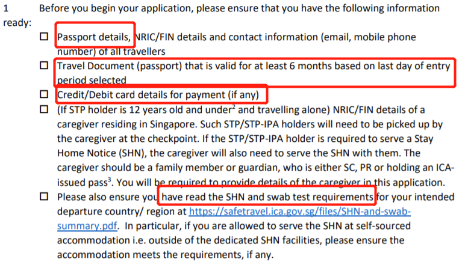
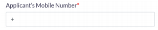
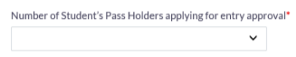
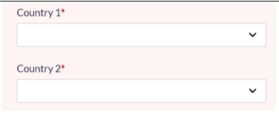

# 顺利入读NTU的秃头之路-副本

1.  作者：季煜璐

2.  更新日志

    1.  不会github啥的, 就笨办法手动更新吧, 待一直填坑

    2.  05271000：v1

    3.  0527-2300

        1.  Bug: 新加坡并非对中国免签,见链接页面中的Travel Documents by
            Countries and Places部分, 中国在需要ENTRY VISA的列表内.

        2.  **但是申请IPA会自动给你申请VISA,所以这个错误可以忽略,也不用管VISA是啥，我们需要的是IPA和EA**

        3.  Bug: IPA处理时间5天,5-10工作日或更长，一般一周内会好。

        4.  补充：[5月底6月初]主题下增加[交学费]子主题.

        5.  [528修正,详见528更新记录]~~补充：[5月底6月初]-[IPA申请]主题下, eForm签字统一按照护照英文如JI YULU~~

        6.  补充：[5月底6月初]-[IPA申请]-[③填表]，Travel
            Document细节化为International Passport[其他视自己情况定]
            
    4. 0528-2000
        
        1.  Bug：IPA申请时eForm16签字按照护照上手签signature形式签. 【已经签好拼音的话应该也没有问题, 毕竟我一个毕业的同学说从过去到在坡从来没有签过中文. 】
        2.  528更新：Taiwan被剔除出group 0. 请见文件<https://safetravel.ica.gov.sg/files/SHN-and-swab-summary.pdf>
        3.  补充主题： [重要官方网站]
        4.  待填坑：学费...暂时还未付钱...
        5.  补充：[6月-7月初,[申请完EA后]抵坡前订机票等]主题下增加订酒店的说明.
   
3.  重要官方网站

    1.  **95%满足需求且实时更新** STPHL requirements. 而且有很多超链接比如[留观政策](https://safetravel.ica.gov.sg/files/SHN-and-swab-summary.pdf)，比如[申请EA的STO online
            portal](https://eservices.ica.gov.sg/STO)

4.  名词解释

    1.  SHN: Stay-Home Notice, 坡关于新冠的留观和核酸检测政策

        具体见文件<https://safetravel.ica.gov.sg/files/SHN-and-swab-summary.pdf>
        Group 0: *Australia, Brunei Darussalam, Mainland China, New Zealand* 
        若属于Group 0,则不需要留观. 只需要在入境时核酸检测-\>在自费单人住所住两天等核酸结果

    2.  ICA: 新加坡移民关卡局, 官网:[Immigration & Checkpoints Authority
        (ICA)](https://www.ica.gov.sg/)

        处理各种签证事宜的政府机构

    3.  STP: student's pass, 学生签证

    4.  IPA/STP-IPA: student's pass in-principle letter.

        **初次入境就读申请的STP临时文件, 入境后注册、体检合格后到ICA
        building申请将IPA转为STP**

    5.  EA: Entry Approval, 持各类签证的人都需要申请的一个入境许可.

5.  **本文面向读者**：

    1.  2021MSC FINANCE, 719迎新, 726开学[其他项目应该也可以参考? I don't know]

    2.  初次入境, **属于留观政策中的Group 0, 不需要SHN**,
        入境时核酸阴性,无合格随行人员

        Group 0: *Australia, Brunei Darussalam, Mainland China, New Zealand,
        Taiwan* 我们的目标是申请相关入境目的签证(对学生来讲就是STP/IPA)和EA即可.

    3.  **其他group可参考流程，但是时间规划需根据SHN调整**. 有随行人员见STPHL
        requirements[student's pass holder lane requirements]

    4.  **注意事项：①情况可能有变,请实时追踪邮件/消息群/本文所给参考链接.
        作者也蛮懒的, 但会尽力更新[冲！].②
        免责条款[本着服务自己且乐于分享的原则, 作者已尽力处理本文, 但难免有错误.
        若因厚爱此文导致经济损失如不可退的申请费等, 后果自负.].**

    5.  **The applicant must have a valid pass at all times. If the
        e-appointment date is beyond the validity of social visit pass, please
        consult ICA for advice on extension, refer to ICA**
        [website](https://www.ica.gov.sg/enter-depart/extend_short_stay)**.**
        **Overstaying is a punishable offence under the Immigration Act.**

6.  项目事宜[20/21 MSC FINANCE]

    1.  学杂费 \$50800[约25w rmb]：

        1.  构成：学费[含留位费/报名费/enrollment fee]、学生服务费、教材费

        2.  支付选项：全额/等额两期, 在5月底邮件链接中选择.

        3.  支付方式：

            

7.  流程

    1.  **IPA-\>EA-\>机票、体检预约等-\>抵坡[核酸]-\>IPA换STP**

        

        来源于5.21 briefing截图.

    2.  5月底6月初, 申请IPA、交学费

        1.  IPA申请

            1.  时间：在课程开始前的**1-2个月**内申请, **IPA有效期6个月,
                IPA≠STP.**

            2.  地址：[SOLAR系统](https://safetravel.ica.gov.sg/files/SHN-and-swab-summary.pdf), 具体见操作

                Student's Pass OnLine Application & Registration.
                用于申请和更新已签发的STP的信息

            3.  操作：根据学校发的SOLAR application邮件操作,
                以及参考STP/IPA申请教程@NTU

                1.  ①确认信息：确认邮件附件(SOLAR FORM)信息是否正确,若否,联系NTU

                    SOLAR FORM/Registration Acknowledgement Letter的来源：
                    ​NTU已经将你的基本信息注册到了ICA. 已注册的基本信息如下: 1.
                    name, date of birth, gender, and nationality (as appear in
                    your travel document) 2. Course details, course commencement
                    and course end dates 3. SOLAR application reference number

                2.  ②登录：使用SOLAR FORM上的五个字段(SOLAR app no., Name, Sex,
                    Nationality, Birth Date)登录[SOLAR系统](https://safetravel.ica.gov.sg/files/SHN-and-swab-summary.pdf). **Kindly ensure that
                    your name input onto the ICA (Student login page) follows
                    the format reflected on the SOLAR form provided.**

                3.  ③填表：点击"Submit **eForm16**"，填表

                    1.  若父母是坡籍或在坡工作/居住需要填TA的NRIC/FIN number.

                    2.  在坡地址和联系方式字段，留白即可(若有可填)，后续更新.

                    3.  邮箱字段: 填可以联系到你的邮箱即可

                    4.  Travel document：一般选international
                        passport.[其他视自己情况]

                    5.  注意事项：

                        1.  填表过程中需要上传近期护照尺寸的彩照. 需要满足以下:

                            (1)3月内近照. (2)彩照, 背景白色. (3)露全脸, 不戴帽.

                4.  **④打印eForm16**：后续完成STP申请手续需要**签名纸质版eForm16,**

                5.  **签名统一按照护照英文如JI YULU**

                6.  ⑤提交

                7.  ⑥付钱：\$30.[7日内付掉,否则需重新申请]

                    交钱的时候不要点浏览器的前或退，否则可能终止交易.
                    需要重新申请.

                8.  处理时间：5-10个工作日[或更长by case]

                9.  查看申请状态：SOLAR系统

                10. 批准后，**打印IPA**

        2.  交学费

            1.  见NTU发的邮件.

    3.  6月初[在申请完IPA后], 申请EA

        1.  假设：没有合格随行人员, 就学生为自己申请, 若有则见参考

        2.  参考：NTU下发information guide.zip, [STPHL
            requirements](https://safetravel.ica.gov.sg/stpl/requirements-and-process)[student's
            pass holder lane requirements for EA application],
            [EA网申指南](https://safetravel.ica.gov.sg/files/stp-application-step-by-step-guide.pdf),
            [STO online
            portal](https://eservices.ica.gov.sg/STO)[在该网站申请EA]

            

        3.  申请前

            1.  **有STP/IPA**

            2.  规划到达时间,看看机票等

            3.  下载WhatsApp Messenger, 注册NTU账号,
                注册NTU邮箱[两个注册不一定在这时候,看学校邮件通知进度]

        4.  申请

            1.  时间：在达到前 **2周-2月**内申请, 申请时会让你选择到达时间,
                **在所签发EA上规定的有效周[一周]内抵坡**

            2.  流程

                1.  准备材料

                    

                    主要就是护照[在抵达周最后一天之前还有至少6月有效期,
                    去更新总是没错的]和信用卡信息

                2.  第1步：登录STO online portal

                    1.  用邮箱登录

                        

                    2.  Email用于接收你的EA. OTP是one time password发到你邮箱.

                        

                        若此时NTU已经开通用NTU邮箱, 不过用自己的也没多大问题.
                        况且我猜还没有开通--\|

                    3.  选择apply for SPL

                        

                3.  第2步：填基本信息

                    1.  输入电话, 首选输入坡手机号, 若无输入+86
                        xxxxxxxxxxx[即记得输入区号如+86]

                        

                    2.  我选NO, 其他情况详见
                        [EA网申指南](https://safetravel.ica.gov.sg/files/stp-application-step-by-step-guide.pdf)

                        

                    3.  我选NO, 其他情况详见
                        [EA网申指南](https://safetravel.ica.gov.sg/files/stp-application-step-by-step-guide.pdf)

                        

                    4.  我选NO, 其他情况详见
                        [EA网申指南](https://safetravel.ica.gov.sg/files/stp-application-step-by-step-guide.pdf)

                        

                    5.  我填1, 其他情况根据自己情况来

                        

                    6.  我填0, 其他情况根据自己情况来

                        

                    7.  确认信息无误, 再点NEXT.
                        因为点了NEXT之后不能回来再改,除非重新提交

                        

                4.  第3步：填STP/IPA和护照信息

                    1.  我选IPA, 其他视你情况, 选STP和IPA后续信息填写是不一样的

                        

                    2.  若选了STP, 根据STP和护照信息填, FIN NO.也是STP上的. The
                        student’s FIN (Student’s Pass) needs to be valid for at
                        least 14 days after the last day of his/her travel
                        validity period.EG, if the student applies and is
                        approved for entry for the period of 3 May 2021 – 9 May
                        2021, the FIN expiry date must be 23 May 2021 or later.

                        

                    3.  若选了IPA, 根据IPA和护照信息填. **注意以下尤其第二条!**

                        

                        

                        ①IPA app no. 不是FIN no. 后续申请了STP才有FIN no.
                        ②如第二张图, Full name字段填形如HANXIAOMEI
                        只有英文字母[a-zA-Z]不要有其他.

                5.  第4步：填随行人员的信息[若适用]-略

                6.  第5步：填旅程信息Travel details

                    1.  选择出发国家/地区,
                        若抵坡前14天到过其他国家/地区或者转机,选YES

                        

                    2.  若上面选了YES,选数量和具体地点

                        

                        

                    3.  选择抵达周,若选择周not available, 会被提示选择新周.
                        **注意EA签发后,不可更改抵达周.若要更改,需重申.**

                        

                    4.  新冠管控下GROUP1,2的人可以看看↓

                        

                        

                7.  第6步：填进一步信息

                    1.  填护照信息-部分要求参照之前填的护照信息,比如Full
                        name只能[a-zA-Z]等

                        

                        

                    2.  填随行人员信息[若适用]

                        

                        ​

                    3.  点下拉框核实信息, 若要修改点下拉框后点Modify

                        

                8.  第7A步：填caregiver信息[若适用]-略

                9.  第7B步：填accompanying Work Pass Holder信息[若适用]-略

                10. 第8步：确认条款和付款明细

                    1.  确认条款-点SUBMIT-确认付款明细[若有误请勿付钱并重新申请]-点MAKE
                        PAYMENT

                        

                        

                        

                11. 第9步：付钱

                    1.  付款有困难STO来帮你: contact the Safe Travel hotline at
                        6812 5555

                        

                12. 第10步：申请成功！查收邮箱中的EA letter！

                    1.  **注意以下**

                        

                        ①申请成功则会出现如图界面 ②打印或者截图以备记录
                        ③确保邮箱中收到EA letter

    4.  6月-7月初,[申请完EA后]抵坡前订机票等

        1.  订机票\&Confirm flight/travel details to
            Singapore???,我猜是订机票的一个环节?

        2.  在NTU Travel
            Declaration系统上更新自己已确认的航班和旅程信息[**出发前至少2周**,根据con-
            offer.pdf-Travel Declaration], 如有变更需在系统上更新

        3.  在[NTU Contact
            Information](https://sso.wis.ntu.edu.sg/webexe88/owa/sso_login1.asp?t=2&p2=https://wis.ntu.edu.sg/webexe/owa/pgr$wuhan.main)系统上更新新加坡手机号[若有]--确保SHN[若适用]期间始终能联系到你--如有变更需在系统上更新

        4.  6.22 线上预定体检日期

        5.  6.28 两门线上课程 python for finance&excel for finance

        6.  7.5之前提交学历证明和完整成绩单[见con-offer.pdf][具体操作见后续邮件]

            

        7.  SHN[若适用]必备物品-information guide.zip

            

        8.  其他事项

            1.  在正式入学前需要**Online Matriculation**[con-offer.pdf],
                具体会讲, 发生时间也可能是抵坡后

    5.  7月初-7月中,抵坡前3天

        1.  参考:一切[若适用]的细节见 [STPHL
            requirements](https://safetravel.ica.gov.sg/stpl/requirements-and-process)[student's
            pass holder lane requirements]: Pre-Departure for Singapore

        2.  抵坡前三天

            1.  Group 0 不需要--抵坡前核酸检测[若适用]

            2.  出发前健康旅居情况史的提交和app的下载.

                1.  在SG Arrival
                    Card(SGAC)[SG入境电子卡]上报出发前健康旅居情况史

                2.  注册预付入境核酸检测.
                    [在樟宜机场入境点这](https://safetravel.changiairport.com/).[在丹那美拉轮渡码头入境点这](https://oat.mpa.gov.sg/).通过陆路入境者,
                    直接现场操作.

                3.  下载并激活三个app.
                    [TraceTogether](https://www.tracetogether.gov.sg/),
                    [Homer](https://www.homer.gov.sg/) and
                    [WhatsApp](https://www.whatsapp.com/download)

                    

                    TraceTogether是任何group都要下载的,用于通知你是否近距离接触新冠疑似病例.
                    Homer是需要SHN的group需要下载.
                    WhatsApp类似微信,是坡常用通讯工具.

    6.  出发日

        1.  登机前手续

            1.  EA Letter, STP/IPA

            2.  [中国国籍不需要]Valid visa to enter Singapore (for visa-required
                travellers).

            3.  [group 0不需要]Valid certificate of negative result for a
                COVID-19 PCR test taken within 72 hours before departure for
                Singapore (if applicable).

        2.  [TraceTogether](https://www.tracetogether.gov.sg/) app

            1.  要求已经注册好app和填好基本信息. 具体可见网页,
                或者**[抵坡前3天]**主题下的图片

            2.  提醒：还需要在离坡后连续14天保留 TraceTogether app和data.

    7.  抵坡[最晚716要到了]

        1.  参考: [STPHL
            requirements](https://safetravel.ica.gov.sg/stpl/requirements-and-process),[STP/IPA申请教程@NTU](https://www.ntu.edu.sg/life-at-ntu/student-life/onestop/student%27s-pass/application-of-student%27s-pass),
            [STP申请手续](https://www.ica.gov.sg/reside/STP/collect)

        2.  入境手续

            1.  出示相关证件, 和已经注册填好信息的TraceTogether
                app,入境检查结束后,app上点“ACTIVATE”激活.

        3.  入境核酸检测. [+SHN若适用]

            1.  \$160

            2.  当场付,
                或者之前在**[抵坡前3天]**主题下已经付过.注册预付入境核酸检测.
                [在樟宜机场入境点这](https://safetravel.changiairport.com/).[在丹那美拉轮渡码头入境点这](https://oat.mpa.gov.sg/).通过陆路入境者,
                直接现场操作.

        4.  乘私人交通到住处[何种类型的住处取决于SHN]. 公交不行.
            若是NTU住宿生,不能直接到NTU宿舍.

        5.  在住处等48小时出PCR阴性结果.阴性结果后才能外出活动.

        6.  体检

            1.  在Fullerton Health @ NTU进行体检.
                体检若没通过则不能上学且得自费回家.

                体检除常规外还包括HIV和肺结核检查.

        7.  办理STP[Completion of formalities (**COF**) for Student's
            Pass,办理学生签证手续]

            1.  登录[SOLAR系统](https://eservices.ica.gov.sg/solar/index.xhtml)

            2.  选择"View Application Status"

            3.  上传体检报告,接受条款

            4.  提交所要求的COF文档

            5.  付钱 \$60.

                \$60是必付的签发费. 另有Multiple-journey fee (if applicable)
                Determined by ICA \$30.

            6.  预约现场拿STP.

                1.  [网上预约](https://eservices.ica.gov.sg/ibook/index.do)日期时间.

                2.  地点：如下

                    Visitor Services Centre ICA Building 10 Kallang Road, Level
                    4 Singapore 208718 (next to Lavender MRT station)

                3.  材料：IPA
                    letter上所要求的材料和[填好的条款确认书](https://www.ica.gov.sg/docs/default-source/ica/files/docs/terms_-_conditions_stp.pdf)

                4.  当天去自助取票机拿号排队然后拿STP

        8.  其他事项：

            1.  原件验证[con-offer.pdf-**Verification of Original Documents**]

                1.  Verification Report for Degree Certificate,
                    这个应该在7.5之前学校邮件通知完成.见[抵坡前订机票]主题下[其他事项]

                2.  其他文件的现场验证[见邮件,截止5.26还未发]

                    

                    
